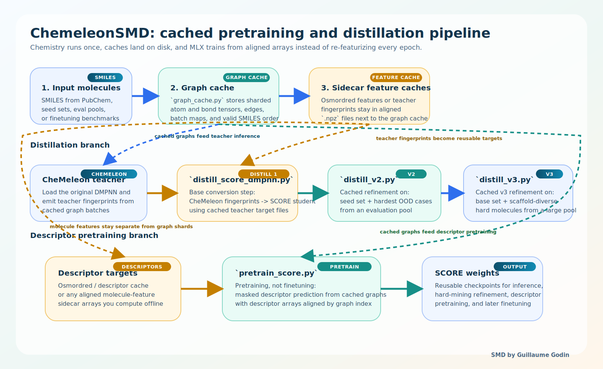
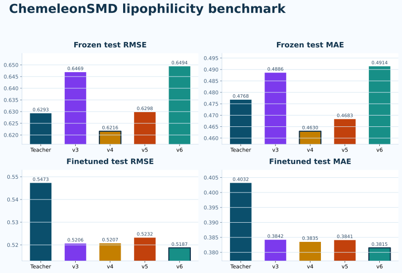

# ChemeleonSMD

**SCORE MLX Distilled** CheMeleon molecular fingerprints for Apple Silicon, with cached MLX distillation, descriptor pretraining, and finetuning flows.

Here, **SMD** stands for **SCORE MLX Distilled**.



ChemeleonSMD distills the [CheMeleon](https://zenodo.org/records/15460715) pretrained Directed Message Passing Neural Network (DMPNN) into a [SCORE](https://arxiv.org/abs/2603.10544)-style architecture running natively on [MLX](https://github.com/ml-explore/mlx). The public repo now includes the reusable graph-cache infrastructure used to remove repeated RDKit featurization from distillation, descriptor pretraining, and finetuning loops.

## Key Features

- **2048-dim molecular fingerprints** from a pretrained graph neural network
- **Apple Silicon native** — runs on MLX, no CUDA required
- **Contractive SCORE dynamics** — Euler skip connection (`alpha=0.5`) gives stable recurrent message passing
- **ChemProp-compatible** featurization (72-dim atoms, 14-dim bonds)
- **Cached graph training pipeline** — distillation, pretraining, and finetuning can reuse sharded graph tensors across epochs and reruns
- **Separate sidecar feature caches** — Osmordred or other molecule-level features stay aligned without being mixed into the graph cache

## Installation

```bash
git clone https://github.com/guillaume-osmo/ChemeleonSMD.git
cd ChemeleonSMD

# Recommended for this repo: use the local sibling mlx-graphs checkout,
# not the older PyPI mlx-graphs build
pip install -e ../mlx-graphs

# Fetch the model weights (stored with Git LFS)
git lfs install
git lfs pull

# Core inference package
pip install -e .

# Optional demo dependencies
pip install -e ".[demo]"

# Optional training / pretraining dependencies
pip install -e ".[training]"
```

> **Note:** The `.npz` weight files are stored with [Git LFS](https://git-lfs.com/). If you cloned without LFS installed, the weight files will be small pointer files. Run `git lfs install && git lfs pull` to download the actual weights.

> **Local graph stack:** development and benchmarking in this repo are intended to run against the local sibling `../mlx-graphs` checkout. If that editable install is already present, `pip install -e .` and `pip install -e ".[demo]"` will reuse it instead of pulling the older PyPI package.

## Quick Start

```python
from chemeleon_smd import fingerprint

fp = fingerprint("CCO")
print(fp.shape)  # (1, 2048)

fps = fingerprint(["CCO", "c1ccccc1", "CC(=O)O"])
print(fps.shape)  # (3, 2048)
```

## What Is Cached

### 1. Graph cache

`chemeleon_smd/graph_cache.py` stores sharded molecular graph tensors on disk:

- atom features
- bond features
- edge indices
- reverse-edge indices
- graph-to-batch mapping
- cached valid SMILES order

This cache is intentionally graph-only. It does **not** automatically store arbitrary molecule-level descriptor arrays.

### 2. Molecular feature caches

If we use extra molecule-level features, we cache those separately as aligned sidecar arrays:

- `pretrain_score.py --mordred-cache` caches Osmordred descriptor matrices in `.npz`
- `distill_score_dmpnn.py` saves cached teacher fingerprints in `teacher_fps_*.npz`
- `distill_v2.py` and `distill_v3.py` save the distilled training sets they build as `fingerprints + smiles` `.npz` files

So yes, we can add molecular features too. The clean pattern is:

1. keep graphs in the graph cache
2. keep descriptor or target arrays in a sidecar cache
3. use cached SMILES order or `batch.graph_indices` to stay aligned

That separation keeps the graph cache reusable across different objectives.

## Training And Demo Scripts

### `distill_score_dmpnn.py`

Base CheMeleon-to-SCORE conversion step.

- builds a cached graph dataset from a SMILES file
- precomputes teacher fingerprints once
- trains a SCORE-DMPNN student against those cached teacher targets

This is the first conversion step from CheMeleon weights into SCORE weights.

### `distill_v2.py`

Cached hard-mining refinement stage.

- starts from a seed teacher-fingerprint dataset
- adds the hardest out-of-domain molecules from an evaluation pool
- trains from cached graph batches instead of re-featurizing every epoch

### `distill_v3.py`

Cached v3 scaffold-diverse hard-mining refinement.

- starts from a base training dataset such as v2
- selects new hard molecules from a large evaluation pool using cosine thresholds
- adds scaffold-diverse subsets from the hard ranges
- computes teacher fingerprints on cached hard-molecule graphs
- trains the student on a cached full v3 graph set

So yes: **v3 is cached**.

### `pretrain_score.py`

Descriptor pretraining script, **not** a finetuning script.

- computes Osmordred descriptor targets
- caches those descriptor targets with `--mordred-cache`
- builds or reuses the molecular graph cache
- trains SCORE to predict masked descriptors from cached graph batches

### `finetuning_demo.py`

Lipophilicity demo using the bundled weights.

This is the downstream cached finetuning stage shown in the pipeline diagram.

The demo now also reuses a persistent graph cache instead of re-running RDKit featurization every batch.

## Architecture

Both the teacher and student share `W_h` across message passing iterations. The difference is in the **forward dynamics**, not the parameter count.

### Teacher: CheMeleon DMPNN (hard overwrite)

```text
H_t = ReLU(H_0 + W_h · M_t)    for t = 1..5
```

### Student: SCORE-DMPNN (Euler skip connection)

```text
H_new = ReLU(H_0 + W_h · M_t)
H_t   = 0.5 · H_{t-1} + 0.5 · H_new    for t = 1..5
```

The mean-pooled atom representations produce 2048-dim molecular fingerprints.

## Distillation Summary

The SCORE-DMPNN student was distilled to reproduce the teacher's 2048-dim fingerprints through iterative hard case mining:

| Version | Training strategy | Total train | Epochs |
|---|---|---:|---:|
| **v3** | 10K seed + 10K OOD + scaffold-diverse hard set | 31K | 50 |
| **v4** | v3 + 10K scaffold-diverse hard cases | 40K | 50 |
| **v5** | v4 + 20K scaffold-diverse hard cases | 50K | 20 |
| **v6** | v5 + all remaining OOD cases | 82K | 10 |

Only about **82K molecules** were needed to distill the full CheMeleon model into SCORE dynamics.

## Evaluation on PubChem

Cosine similarity between teacher and SCORE-DMPNN student fingerprints, evaluated on the full PubChem training set used for the original distillation study:

| Version | Mean cos | < 0.98 | < 0.95 | < 0.90 | P01 |
|---|---:|---:|---:|---:|---:|
| v3 | 0.9865 | 152,615 | 20,483 | 3,694 | 0.930 |
| v4 | 0.9892 | 75,517 | 8,285 | 1,291 | 0.953 |
| v5 | 0.9905 | 37,037 | 3,018 | 442 | 0.967 |
| **v6** | **0.9910** | **17,324** | **555** | **53** | **0.977** |

The default shipped model is **v6**.

## Finetuning: Lipophilicity Benchmark

Finetuning on MoleculeNet [Lipophilicity](https://moleculenet.org/) with a 2-layer FFN head:

| Model | RMSE | MAE |
|---|---:|---:|
| CheMeleon teacher (frozen) | 0.619 | 0.478 |
| CheMeleon teacher (finetuned) | 0.538 | 0.394 |
| SCORE-DMPNN v6 (frozen) | 0.623 | 0.455 |
| **SCORE-DMPNN v4 (finetuned)** | **0.518** | **0.380** |
| SCORE-DMPNN v6 (finetuned) | 0.519 | 0.385 |



The figure above shows the current run's downstream lipophilicity **test** metrics only.

A controlled MLX memory probe on one cached 64-graph finetuning batch showed:

- CheMeleon teacher peak memory: `1556 MB`
- SCORE-DMPNN v4 peak memory: `1683 MB`
- SCORE-DMPNN v6 peak memory: `1683 MB`

So the teacher is **not** intrinsically heavier in this controlled path. If it looks bigger earlier in the full demo, that is more likely first-model execution or allocator behavior than model size.

## Weight Conversion

To convert from the original PyTorch CheMeleon checkpoint:

```bash
python -m chemeleon_smd.convert_weights
```

This downloads the checkpoint from Zenodo and saves MLX weights to `chemeleon_smd/weights/`.

## Project Structure

```text
chemeleon_smd/
├── __init__.py
├── chemeleon_score.py      # SCORE descriptor-pretraining model
├── convert_weights.py      # PyTorch -> MLX weight conversion
├── graph_cache.py          # Persistent sharded graph cache
├── inference.py            # fingerprint() API
├── layers.py               # SCORE / descriptor helper layers
├── mol_featurizer.py       # ChemProp-compatible atom/bond featurization
├── mpnn.py                 # Teacher model + Set2Set readout
├── score_dmpnn.py          # Student model + teacher/student init helpers
└── weights/
    ├── chemeleon_mpnn.npz
    ├── chemeleon_mpnn_config.json
    ├── score_dmpnn_distilled_v3.npz
    ├── score_dmpnn_distilled_v4.npz
    ├── score_dmpnn_distilled_v5.npz
    └── score_dmpnn_distilled_v6.npz

distill_score_dmpnn.py      # Base cached teacher -> student distillation
distill_v2.py               # Cached hard-mining refinement
distill_v3.py               # Cached scaffold-diverse hard-mining refinement
pretrain_score.py           # Cached descriptor pretraining
finetuning_demo.py          # Cached lipophilicity demo
assets/
├── chemeleonSMD_benchmark_summary.svg
└── chemeleonSMD_cached_pipeline.svg
```

## License

MIT
